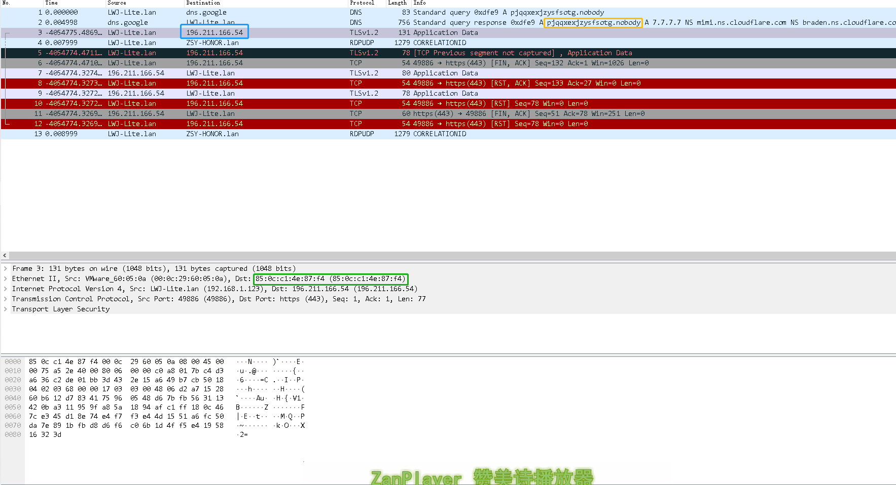

# Remove physical info from pcapng file

Replace ip, mac, dns domain of server to another one so you could share packet publicly to analyze.

### Usage

Install pip package first:

`pip install -r requirement`

```python
import replace_data_in_pcapng as rp
server_ip1='8.8.8.8'
server_ip2='4.4.4.4'
server_name1='hi.hello.com'
server_name2='bye.hello.com'
pcapng_file_name='test.pcapng'
rp.replace_pcap(pcapng_file_name,[server_ip1, server_ip2],[server_name1,server_name2]) )
```

### Result



### Feature

- REMOVE DNS domain name request 

- REMOVE  TCP IP

- REMOVE MAC

תודה לאל
