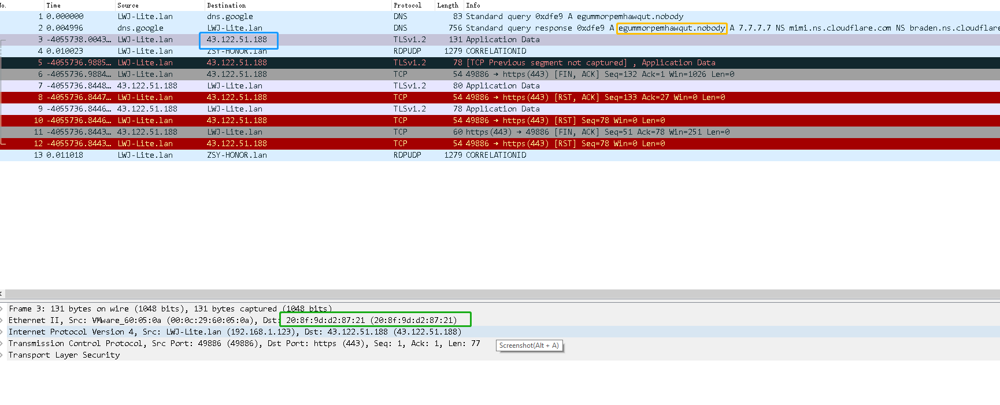

# Remove physical info from pcapng file

Replace ip, mac, dns domain of server to random one so you could share packet publicly to analyze.

### Usage

Install pip package first:

`pip install -r requirement`

```python
import replace_data_in_pcapng as rp
server_ip1='8.8.8.8'# ip for replacing with random one
server_ip2='4.4.4.4'# ip for replacing with random one
server_name1='hi.hello.com' #domain for replacing with random one
server_name2='bye.hello.com'#domain for replacing with random one
pcapng_file_name='test.pcapng'
rp.replace_pcap(pcapng_file_name,[server_ip1, server_ip2],[server_name1,server_name2]) )
```

### Result

- before


- after

 

### Feature

- REPLACE related DNS domain name request to random one

- REPLACE related IP to random one

- REPLACE MAC related corresponding ip to random one

תודה לאל
